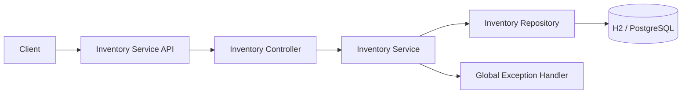
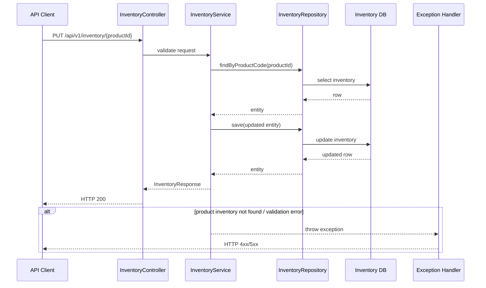
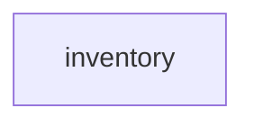

# Inventory Service

Spring Boot microservice for inventory availability and stock movement tracking.

## Service Scope
- Manage inventory by `productId`/`productCode`

## Tech Stack
- Java 25
- Spring Boot 4
- Spring Data JPA
- H2 / PostgreSQL
- OpenAPI (Swagger)

## Default Port
- `8083`

## Architecture Flow


## Sequence Diagram


## Database Schema
- `inventory` (unique `product_code`)

### ER Diagram


## Key APIs
- `GET /api/v1/inventory`
- `GET /api/v1/inventory/{productId}`
- `POST /api/v1/inventory`
- `PUT /api/v1/inventory/{productId}`
- `DELETE /api/v1/inventory/{productId}`

## Build and Run
```bash
./gradlew clean build
./gradlew bootRun
```

Run with PostgreSQL profile:
```bash
./gradlew bootRun --args='--spring.profiles.active=postgres'
```

## API Docs
- Swagger: `http://localhost:8083/swagger-ui.html`
- OpenAPI: `http://localhost:8083/api-docs`
- 